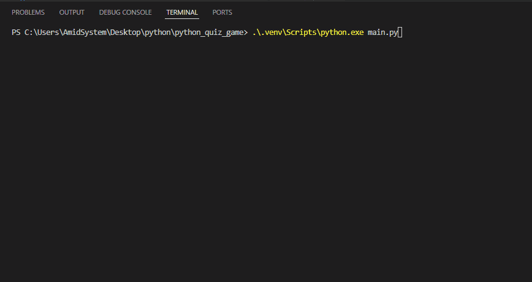

# Python Quiz Game 


A simple quiz game built with Python
## Table of contents
- [Python Quiz Game](#python-quiz-game)
  - [Table of contents](#table-of-contents)
  - [Features](#features)
  - [Project Structure](#project-structure)
    - [File Description](#file-description)
  - [Requirments](#requirments)
  - [Installation](#installation)
  - [Envoirment Setup](#envoirment-setup)
  - [Usage](#usage)
  - [Example Output](#example-output)
  - [Screenshot](#screenshot)
    - [start game](#start-game)
    - [quiz](#quiz)
    - [final score](#final-score)
  - [Demo](#demo)
  - [Roadmap](#roadmap)
  - [Contributing](#contributing)
  - [Licence](#licence)
  - [Author](#author)


## Features
- Quiz System
  - Asks the player multiple question
  - Cheks the ansewrs automaticlly
  - Calculates the final score 
- Resulte storage
  - Saves quiz results in `results.txt`
- Admin Mode
  - asks for the admin password 
  - checks if the password is correct
  - keeps the private information outside the main python file
  - Loads the password from `.env`


## Project Structure

```text
python_quiz_game/
│   .env.example
│   .gitignore
│   main.py
│   question.py
│   README.md
│   requirements.txt
│
├───gifs
│       demo.gif
│
├───pictures
│       1.png
│       2.png
│       3.png
└───
```
### File Description
| file | description |
| --- |---|
| `main.py` | main file used to run quiz game|
| `question.py` | stores questions and answers|
| `requirements.txt` | lists the python packages needed for the project|
| `.env.example` | shows the envoirment variables needed by the project |
| `.gitignore` | tells git which files and folders shold not be tracked|
|  `README.md` | contains the project documentation|
|  `pictures/` | stores project sreenshots|
|  `pictures/1.png` | screenshot of the game start|
|  `pictures/2.png` | screenshot of the quiz section|
|  `pictures/3.png` | screenshot of tfinal result|
|  `gifs/` | stores demo GIF files|
|  `gifs/demo.gif` |shows the project demo|

## Requirments
Before running the project, make sure you have:
- `python 3`
- `python-dotenv`
  
## Installation
1. open a terminal in the project folder.
2. check that python is installed:
```bash
python --version
```
3. install the python packages:
```bash
pip install -r requirements.txt
```  

## Envoirment Setup
1. create a `.env` file from `.env.example`:
```bash
cp .env.example .env
```
2. open the new `.env` file 
3. replace the example value with your own password
```text
QUIZ_ADMIN_PASSWORD=your_password_here
```
4. save the file.
  
> Do not commit your `.env` file because it may contain private information

## Usage
1. open a terminal in the project folder
2. run the quiz game
```bash
python main.py
```
3. choose `yes` or `no` for admin mode
4. if you choose `yes`, enter the password from your `.env` file
5. enter your name 
6. answer the questions
7. see your final score and message
8. your result is saved in `results.txt`

## Example Output
```text
do u want to open admin mode? yes/no: no

whats your name? alex
welcome

what language are we using?c++
wrong

what command starts a git?git init
correct

what command shows git status?git --oneline
wrong

your score is:  1 out of  3
keep praticing alex
```
## Screenshot

### start game


### quiz


### final score


## Demo 


## Roadmap
- [x] add multiple quiz questions
- [x] calculate the final score
- [x] save results to a file
- [x] add admin mode
- [ ] add more quiz questions
- [ ] add difficultly levels
- [ ] add a timer
## Contributing

## Licence

## Author
create by [mazda](https://github.com/mazda-farvahari)